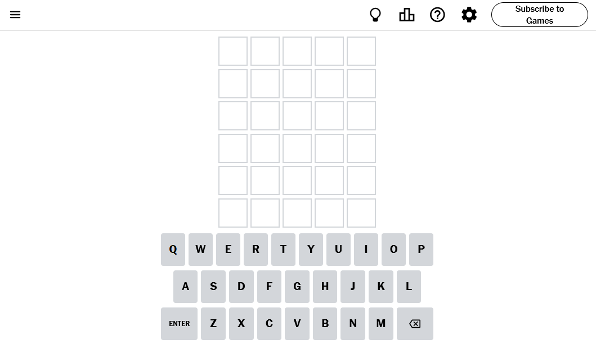
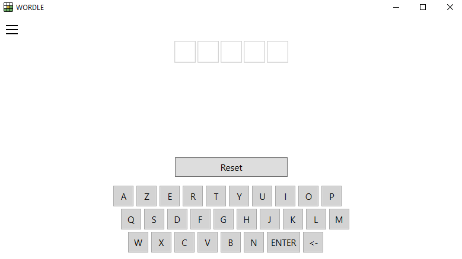
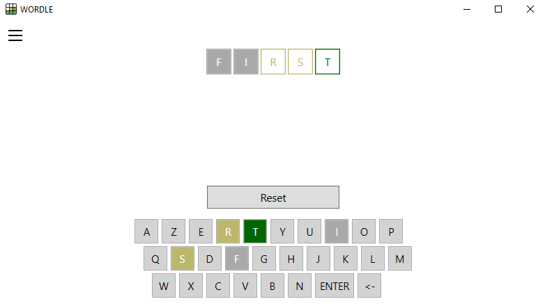
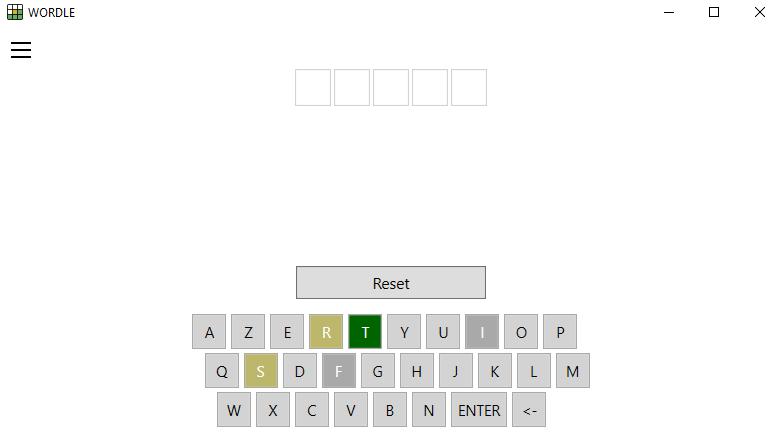
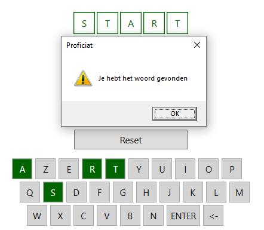

# 1. Overzicht opdracht

## 1.1 Doel van het project
Tijdens de projectweken van WPL1 wordt er naast een C#-project ook een web toepassing uitgewerkt. Doel is om de kennis uit de lessen om te zetten in de praktijk gedurende een langlopende opdracht.  

### C# toepassing (WORDLE)  

Tijdens dit project zullen we het spel WORDLE in C# bouwen in 3 fasen. Hiermee zullen we de competenties rond C# en WPF verder uitdiepen. Je zal uitgedaagd worden om je kennis te verbreden door zelf aan de slag te gaan en informatie op te zoeken over hoe je de verschillende programmeervereisten zou implementeren.

screenshot van het spel op de website van de New York Times

## 1.2 Planning & Fasen

De volledige toepassing zal worden geïmplementeerd in verschillende fasen. In elke fase worden telkens nieuwe functionaliteiten toegevoegd aan het project. Op deze manier worden ook de complexiteit en nodige skills stapsgewijs opgebouwd.

| fase      | Uitleg      | Deadline & PE |
|-----------|-------------|---------------|
| **1**     | **Week 7**  | **Week 9**    |
| **2**     | **Week 9**  | **Week 11**   |
| **3**     | **Week 11** | **Week 13**   |

Elke fase wordt dus gebouwd in één week WPL1 (afwisselend met het Web project). Dit houdt in dat tijdens de WPL1 sessie aan het project gewerkt wordt onder begeleiding van de coaches. Er wordt echter verwacht van de studenten dat, als ze niet klaar zijn, dit verder afgewerkt wordt buiten de begeleide sessie. 

De deadline is **de avond voor de dag van de WPL1 les**. Met andere woorden voor **Week 9** is de **deadline woensdag 20/11/2024 om 23:59.** Je zal tijdens de les een uitbreiding maken op je project die beoordeeld wordt.

## 1.3 Opdracht indienen & Evaluatie

Je dient je project in op blackboard door de URL naar je githubclassroom repository te posten in de inzending en je code te pushen naar deze repository. Je bent zelf verantwoordelijk voor het pushen van je code op de githubclassroom repository.

Let op!
 - Je maakt **niet** zelf een nieuwe repository aan. Gebruik de repository van Github.
 - Push en commit **regelmatig**. Code die lokaal staat kan niet beoordeeld worden.
 - **De projecten worden individueel gemaakt.** In geval van plagiaat, samenwerking of fraude, wordt er een **onvoldoende toegekend voor alle partijen.**

# 2. Basis versie WORDLE (sprint 1)

Het project is gebaseerd op het spel Wordle, een onlinespel gepubliceerd door de New York Times. In het spel heeft de speler het doel om in zo weinig mogelijk pogingen het juiste woord te raden.

Probeer zelf het <a href="https://www.nytimes.com/games/wordle/index.html">spel</a> eens uit.

## Spelverloop

Aan het begin van het spel wordt er een willekeurig vijfletterwoord gekozen uit een vooraf bepaalde lijst van woorden. Het doel van de speler is om dit woord binnen een maximum van 6 pogingen te raden. Na elke poging krijgt de speler feedback over de juistheid van de letters:

- **Grijs**: de letter komt niet voor in het woord.
- **Geel**: de letter komt voor in het woord, maar staat op een andere positie.
- **Groen**: de letter komt minstens één maal voor in het woord en staat op de juiste positie.

Met andere woorden het is mogelijk dat letters meerdere keren voorkomen in een woord, maar als speler krijg je enkel een kleurcode voor de positie waar je de letter ingeeft.

**In de eerste sprint** wordt er nog niet verwacht dat je de volledige applicatie implementeert. In plaats daarvan focus je op het verwerken van **input** en **output**. Je zal er voor zorgen dat je applicatie letters kan verwerken die de speler ingeeft. Vervolgens zal je de ingegeven letters controleren en er feedback op geven. Tot slot voorzie je een reset-knop die de invulvelden weer leeg kan maken.

Je moet nog niet meerdere regels van invulvelden maken. Noch moet het geheime woord willekeurig gekozen worden. Deze uitbreidingen en meer volgen in de volgende twee sprints.

## Technische analyse

### Technische vereisten

- **C#** om de logica van de applicatie te creëren.
- **XAML** om de gebruikersinterface te bouwen.
- **Visual Studio** als programmeeromgeving.

## Functionele analyse

### Ontwerp – User interface

Een eenvoudige opzet voor de gebruikersinterface bevat een startscherm (zie Figuur 1) en een scherm om letters in te voeren en feedback te tonen na elke poging (zie Figuur 2). Het wordt aanbevolen om een eigen ontwerp te maken voor je versie van Wordle.

**Figuur 1**: Startscherm – Begin van het spel.

**Figuur 2**: Feedbackscherm – De ingevoerde letters worden beoordeeld en de feedback wordt getoond door middel van gekleurde vakken.

**Figuur 3**: Reset – De feedback wordt bewaard op het toetsenbord, maar de invulvelden worden terug leeggemaakt.

**Figuur 4**: Winnen - De speler heeft het correcte vijfletter woord ingegeven en wordt gefeliciteerd.

**Belangrijk**: Deze afbeeldingen zijn louter voorbeelden. Het is de bedoeling om je eigen lay-out voor het spel te bepalen. 

### Functionele vereisten

| ID         | Onderwerp           | Beschrijving |
|------------|---------------------|--------------|
| **WORDL-01** | **Opstarten**       | De applicatie start in een begintoestand waarbij er vijf lege invoervelden worden getoond en een knop om het woord te valideren.  _(Zie figuur 1)_  |
| **WORDL-02** | **Woordkeuze**      | Bij het opstarten van het programma wordt er nog geen willekeurig woord gekozen. In plaats daarvan mag je het geheime woord voor de eerste sprint hardcoded in je applicatie bewaren. |
| **WORDL-03** | **Invoervelden met rand**    | Vijf invoervelden worden weergegeven waarin de speler letters kan typen. Elk veld moet een rand hebben en staat voor een letter in het woord. Als speler kan ik enkel alfabetische letters typen in de invulvelden. |
| **WORDL-04** | **Rechtstreeks in velden typen** | Als speler kan ik zonder mijn cursor in één van de velden te plaatsen onmiddellijk typen in de invulvelden. _(Tip: Gebruik hiervoor Window_KeyDown om dit te realiseren.)_|
| **WORDL-05** | **Woord indienen**   | Als speler kan ik een woord indienen voor evaluatie door op de ENTER/RETURN toets te drukken op het toetsenbord. Enkel een woord van exact vijf letters kan ingediend worden. |
| **WORDL-06** | **Woord controleren** | Wanneer de speler een poging indient voor evaluatie, wordt het ingevoerde woord gecontroleerd. Na controle verandert de kleur van elk invulveld om feedback te geven: **grijs** voor een foutieve letter, **geel** voor een letter op de verkeerde plek, en **groen** voor een juiste letter op de juiste plek. Pas minstens de kleur van de rand van de invulvelden aan. _(Zie figuur 2)_ |
| **WORDL-07** | **Toetsenbord in het venster**   | Als speler kan ik gebruik maken van een virtueel toetsenbord dat in het venster getoond wordt om mijn letters in te geven. Verder is er een Backspace- en Enter-toets aanwezig op het toetsenbord. Hiermee kunnen letters verwijderd worden _(Backspace zie WORDL-08)_ en pogingen worden ingediend _(Enter/Return zie WORDL-05)_. |
| **WORDL-08** | **Letters verwijderen**   | Als speler kan ik letters die ik heb ingevuld verwijderen door op de Backspace-toets te drukken. Zowel op het virtueel toetsenbord op het scherm _(Zie WORDL-07)_, als op het fysiek toetsenbord. |
| **WORDL-09** | **Feedback op toetsenbord**   | De kleuren-feedback van WORDL-06 kan de speler ook terugvinden op het toetsenbord. De kleuren van de knoppen veranderen, zodat de speler geholpen wordt met het kiezen van zijn of haar letters. _(Zie figuur 2)_  |
| **WORDL-10** | **Reset knop**   | Als speler kan ik op de reset-knop klikken om alle ingegeven letters en feedback te verwijderen, zodat ik nog een poging kan maken. De kleurcodes op het toetsenbord blijven echter wel staan.  _(Zie figuur 3)_  |
| **WORDL-11** | **Winnen**   | Als speler kan ik het juiste woord indienen om een berichtvenster te zien dat me feliciteert met het vinden van het correcte woord.   _(Zie figuur 4)_ |

## Aanpak en tips

### Stappenplan

- Analyseer wat er geprogrammeerd moet worden en werk een plan uit voor de implementatie. (Je zou de stappen op voorhand al kunnen uitschrijven in nog-in-te-vullen methodes.)
- Probeer te ontdekken welk onderdeel het meest uitdagend is (bijv. het genereren van feedback met de juiste kleuren) en onderzoek hoe je dit kunt oplossen.
- Test het spel om te zien of het correct werkt onder verschillende omstandigheden.
- Zorg ervoor dat je code goed gestructureerd is met duidelijke variabele- en methodnamen.

### Programmeertips
- Probeer eerst de applicatie te bouwen zonder een toetsenbord in het venster.
- Maak een method aan die het ingevoerde woord controleert en de juiste kleuren toewijst aan elke letter.
- Gebruik private class-variabelen om het woord en pogingen te bewaren.
- Gebruik een Border of BorderBrush voor de rand van elk invoerveld om feedback te tonen.
- Gebruik Window_KeyDown om input van het toetsenbord op te vangen.